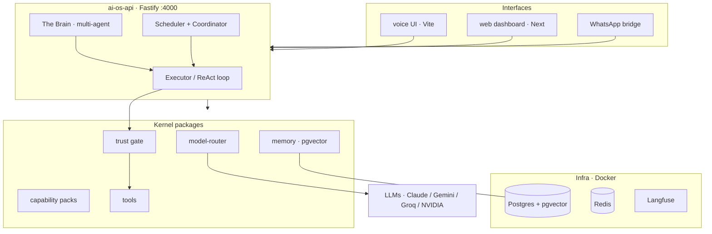

# AI OS

A **local-first, personal AI operating system** — a proactive, memory-having, multi-agent assistant that runs on *your* machine, with *your* keys, and never sends your data to someone else's cloud.

Unlike a chatbot, AI OS has a **domain-free kernel** (planner, memory, context engine, trust gate) and installable **capability packs** (Google, WhatsApp, browser, computer, video, …). It remembers across sessions, improves itself, drives a real browser and terminal, and gates every irreversible action behind your explicit approval.

> Status: active single-developer project. Runs end-to-end today (chat, voice, WhatsApp, browser automation, scheduled autonomy).

---

## Highlights

- **Memory OS** — not chat history: episodic/semantic/procedural memory, a knowledge graph, contradiction detection, reflection, and a nightly "cognitive" consolidation pass.
- **Domain-free kernel + capability packs** — the kernel stays generic; capabilities install as manifests (`{tools, prompt, policies, memories}`) with **zero kernel changes**.
- **Trust gate** — every tool is classified `read | write | irreversible | spend`. Irreversible/spend actions **queue for one-click approval**; money can never be auto-approved.
- **Structural injection defense (§8.3)** — once untrusted content (a web page, an email) enters context, auto-mutations are structurally blocked, independent of the model.
- **Self-extension** — Pack Forge lets the OS author and install *new* tools at runtime (behind a human install gate).
- **Real hands** — general web automation (Playwright), host terminal + file access, a Docker code sandbox, and long-form video understanding.
- **Autonomy, safely** — graduated trust, standing agents, and a daily autonomy governor; all opt-in and off by default.

## Architecture



**Kernel** owns *how* to think (plan → act → observe, memory, trust). **Packs** add *what* it can touch. **Bridges** own external sessions (a Chromium profile, a WhatsApp login) behind a tiny localhost contract, so the OS never holds those credentials directly.

## Getting started

**Prerequisites:** Node 20+, [pnpm](https://pnpm.io), [Docker Desktop](https://www.docker.com/products/docker-desktop/). Windows or POSIX.

```bash
pnpm install
cp .env.example .env          # then fill in at least one model key (GEMINI_API_KEY is a free-tier default)
pnpm os:up                    # docker → migrate → start all services (health-gated)
```

Open the voice UI at **http://127.0.0.1:3001** or the dashboard at **http://127.0.0.1:3000**.

Minimum `.env`: one model provider key (`GEMINI_API_KEY`, `ANTHROPIC_API_KEY`, `GROQ_API_KEY`, …), `AIOS_API_TOKEN` (API auth), and `AIOS_TZ`. See [`.env.example`](.env.example) for the full list (Google OAuth, WhatsApp, browser bridge, etc.).

## Lifecycle

| Command | What it does |
|---|---|
| `pnpm os:up` | Cold → running: Docker, Postgres, migrations, all PM2 services, health-gated |
| `pnpm os:status` | Every service green/red |
| `pnpm os:down` | Stop everything |
| `pnpm os:logs` | Tail service logs |

## Services & ports

| Process | Port | Role |
|---|---|---|
| `ai-os-api` | 4000 | Fastify kernel API (executor, scheduler, coordinator) |
| `ai-os-web` | 3000 | Next dashboard |
| `ai-os-voice` | 3001 | Voice-first UI (Vite) |
| `ai-os-bridge` | 4100 | WhatsApp bridge |
| `ai-os-browser` | 4200 | Playwright browser bridge |
| Postgres / Redis / Langfuse | 5432 / 6379 / 3030 | Data, cache, tracing (Docker) |

## Repository layout

```
packages/
  kernel/         planner, executor, the Brain, scheduler, coordinator, learning loop
  memory/         Memory OS (pgvector store, graph, reflection, cognition)
  model-router/   provider selection + failover; embeddings, vision, STT/TTS, video
  tools/          the tool implementations (gmail, whatsapp, browser, terminal, http, video…)
  trust/          trust gate, §8.3 injection defense, secrets broker
  packs/          capability pack manifests + Pack Forge
  shared/         cross-cutting types/utilities
apps/             api · web · voice · whatsapp-bridge · browser-bridge
infra/            docker-compose + SQL migrations
evals/            the eval "gym" (regression-gated agent tests)
scripts/          lifecycle (up/down/status) + ops helpers
docs/             blueprint, ADRs, design docs
```

## Development

```bash
pnpm typecheck        # tsc --noEmit across the monorepo
pnpm lint             # ESLint (advisory)
pnpm format           # Prettier write
pnpm test             # deterministic smoke suites
pnpm eval             # the eval gym (needs a model key)
```

Design decisions are recorded as ADRs in [`docs/adr/`](docs/adr); the north-star design is [`docs/BLUEPRINT.md`](docs/BLUEPRINT.md).

## Security

AI OS runs real, irreversible actions, so security is architectural, not advisory:

- The API requires `AIOS_API_TOKEN` on every endpoint (except health/OAuth); the UIs inject it server-side.
- Every state-changing tool call is trust-classified and **queued for human approval** unless explicitly promoted; **spend can never be auto-approved**.
- Untrusted content structurally blocks auto-mutations (§8.3).
- Bridges bind loopback only and require a shared-secret token.

See [`docs/`](docs) and the security audit ledger for the current posture and remediation roadmap.

## License

Private project — all rights reserved.
